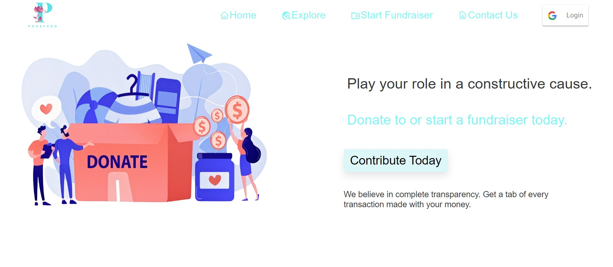
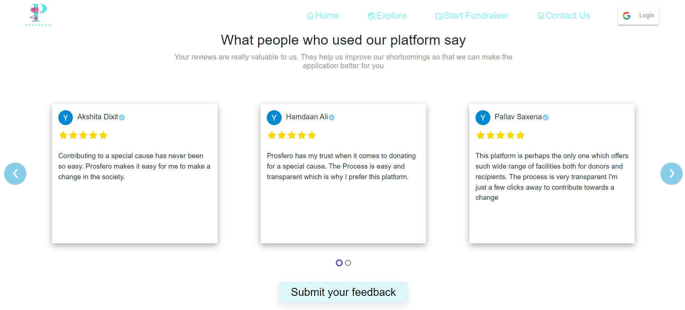

<center><h1><b>

Prosfero</b></h1> 
</center>

<div align="center">

[](https://GitHub.com/Naereen/StrapDown.js/graphs/commit-activity)
[](http://shields.io/)
</div>

<div align="center">


</div>

<div align="center">

[About Us](#About) |
[Getting Started](#Getting) |
[Demonstration]() |
[Contributers](#MongoDB)
</div>


<a name="About"></a>

# About us
<center>



</center>

Prosfero is an Open Source Crowd Funding platform developed by two university students with one dream - 

<center><b>
To help people with monetary issues and ensure that money doesn't get in the way of people trying to make a change. 

</b> </center>

Prosfro is a platform that allows people to donate money, hassle-free, to those in need. 

<a name="Getting"></a>

# Getting Started

### Fork, Clone locally 
<br>

```
git clone https://github.com/shrooot/prosfero.git
cd prosfero
```

## Working with Frontend
<hr/>
Go to frontend folder
<br>
<br>

```
cd frontend
```
Install the node module using the command
```
npm install
```
Set up your environment variables
<br><br>
Create a file called .env.
if you are just making changes in frontend folder, add the key as 

```
REACT_APP_apiUrl=https://prosfero-backend.herokuapp.com
```
or if you are making changes in the backend too,then add the key as 

```
REACT_APP_apiUrl=https://localhost:5000
```
now the frontend project is ready to run in local.
use the below command to run it.
```
npm start
```
commit your changes and create a pull request.

## Working with Backend
<hr/>
Go to backend folder
<br>
<br>

```
cd backend/
```
Install the node module using the command
```
npm install
```
Set up your environment variables
<br><br>
Create a file called .env and set up your keys (keys are confidential ask owner of the project for the keys).
Commit your changes and create a pull request.

<br>

# Demonstration

Contributing through Prosfero is easy. 

<center>


</center>

On the Home Screen one can find the "Contibute Today" Option.
This will redirect you to the Contributions Page.

<center>


</center>

You can now see all open donations under this section.
You can also explore ongoing donations using the "Explore" option on the menu bar.
<br>
Prosfero allows you to filter out the open donations by clicking on the by selecting the various "Categories" on the left pane.
<br>
You can also select a cause from the home page to see the open donations for that specific cause.

<center>


</center>

Prosfero promises complete transpirancy in the donations. You can sumbit your experience and feedback to the prosfero team through the "Submit your Feedback" section. You can also head what others have to say about Prosfero.

<center>


</center>

Have a grevance, issue or a query? Feel free to contact us through the "Contact Us" section.

<center>


</center>